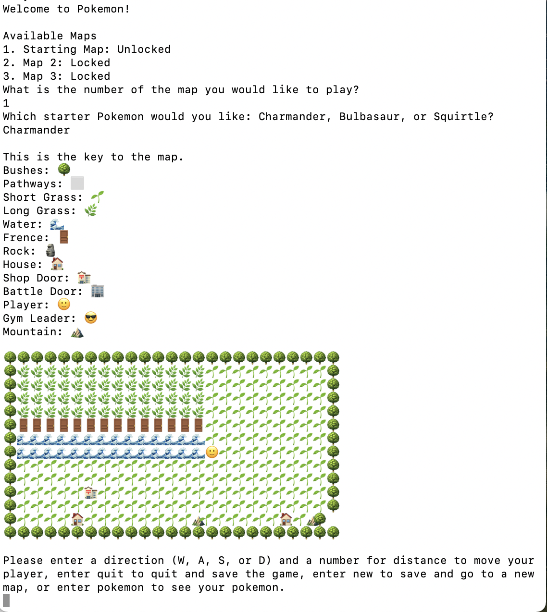

# Pokemon Text Adventure

This was created as a final project for Intro to C Programming during the Fall 2018 semester.

# Instructions

To start the game simply compile and run `Pokemon.c`.

The game includes the ability to have multiple users. To create a new user, follow the instructions provided in game.

There are three maps inluded in the game. But each map is represented only by a txt file, and more maps can be added easily by creating new map files.

To move around the map, enter a distance and direction. The 🌿 represents long grass where wild Pokemon roam. The 🏣 represents a PokeStop where you can heal all of your pokemon.

The game has stats for each Pokemon that is accurate to the real game (HP, Attack, Defense, IV, EV, etc.), and uses accurate stats based on Pokemon type.

